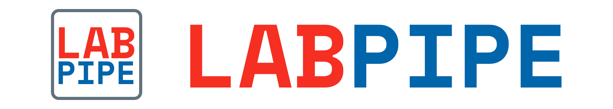

Server to work with LabPipe Client to assist with data collection.

- Configurable: build your own study scaffold
- Light-weight: single jar file to run
- RESTful: streamline with your current solutions with APIs

## Installation

Pre-compiled binary releases can be downloaded from the [releases](../../releases) page. Build from source code option is also available. Read more about installation [here](../../wiki/Installation).

```
java -jar labpipe-server-all.jar
```

## Documentation
The documentation is available [here](http://docs.labpipe.org).

## Roadmap
- [ ] To support running as daemon process
- [ ] To enable plugin manager

## License
This project is open source under Non-Profit Open Software License 3.0 (NPOSL-3.0).